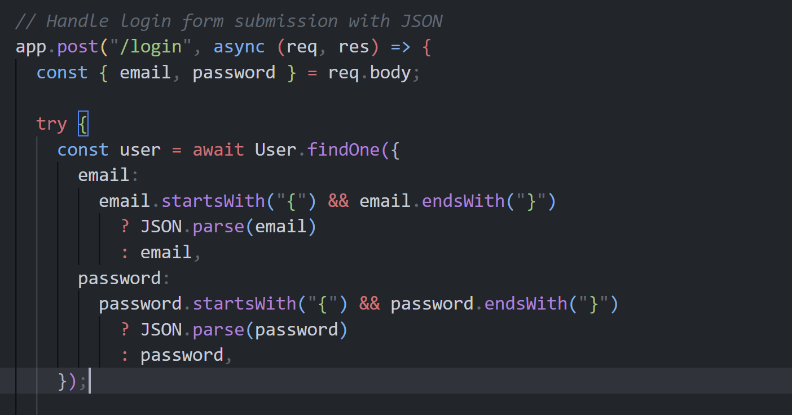

---
tags:
  - وب
---
# No_Sql_Injection

 درود و صد درود بر دنبال کننده‌های ماجراجویی ما در دنیای picoctf !
 یک چالش داریم در زمینه `nosql injection` 
 [picoCTF](https://play.picoctf.org/practice/challenge/443?category=1&difficulty=2&page=1) 
 قراره که با هم فلگ رو پیدا کنیم.

تو قسمت توضیحات چالش برای ما سورس کد رو قرار داده که باگ امنیتی سایت رو پیدا کنیم.

<center>

</center>

همونطور که از این تیکه از کد پیداست ظاهرا اینجا میاد و `email` , `password` رو میگیره بعدش چک می‌کنه اگر این دو تا متغییر استرینگی بودن که با `{` شروع و با `}` تموم شده بودن یک بار دیگه این متغییر رو با JSON پارس می‌کنه. کد همینجا برای ما مشکوک میشه چون ما بتونیم با استفاده از یه سری فیچر که خود mongoose ارائه میده استفاده کنیم و هر چیزی که هست (که شامل ادمین هم میشه) رو پیدا کنیم و دیتاهاش رو نمایش بدیم.

با یک سرچ راحت می‌تونیم بفهمیم که آپشنی هست به اسم `$ne` که اگر مخفف not equal هست و اگر برای اون یک مقدار مشخص کنیم، اگر با اون مقدار برابر نباشه با فیلد `email` مچ میشه. 

پس صرفا کافیه همچین دیتایی رو توی POST استفاده کنیم :

``` JSON 
{
    "username":{
        "$ne":"chertpert"
    },
    "password":{
        "$ne":"chertpert"
    }
}
```
و به راحتی لاگین کردیم !!

??? success "FLAG :triangular_flag_on_post:"
    <div dir="ltr">`picoCTF{This_Is_Invalid_Flag!!!}`</div>

--- 

!!! نویسنده
    [sw33tw3as3l](https://github.com/sw33tw3as3l)
